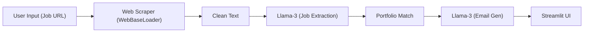

# Cold Email Generator using Llama-3, LangChain & Groq

A Streamlit-based application that scrapes job postings from career pages and automatically generates personalized cold emails using Llama 3 via Groq. This tool matches job requirements with your portfolio to craft compelling outreach messages.

## 🚀 Project Impact
*Why should you care about this project?*

👉 **Automates Outreach**: Generates professional cold emails from job URLs in seconds.  
👉 **Personalized Content**: Matches job skills with specific portfolio links.  
👉 **Boosts Efficiency**: Reduces time spent on initial outreach by a significant margin.

## 🌟 Features

-   **Job Scraping**: Extracts job details from any career or job listing webpage.
-   **Skill Matching**: Uses semantic understanding to match job requirements with your portfolio projects.
-   **Fast Inference**: Powered by Groq's LPU inference engine for near-instant generation.
-   **Clean UI**: Simple Streamlit interface for easy interaction.
-   **LLM Integration**: Leverages Llama 3 (`llama3-8b-8192`) via Groq API.

## 🧠 Architecture



> **User Input** → **Web Scraper** → **Clean Text** → **Job Extraction** → **Portfolio Match** → **Email Generation** → **Streamlit UI**

## 🛠️ Tech Stack

-   **Frontend**: [Streamlit](https://streamlit.io/)
-   **LLM Integration**: [LangChain](https://www.langchain.com/)
-   **Model**: Llama-3.3-70b-versatile (via Groq)
-   **Data Handling**: Pandas (CSV Portfolio)

## 📂 Project Structure

```bash
cold-email-generator/
├── app/
│   ├── main.py          # Application entry point (Streamlit UI)
│   ├── chains.py        # LLM chains for extraction and email generation
│   ├── portfolio.py     # Portfolio loading and querying logic
│   ├── utils.py         # Utility functions (text cleaning)
│   └── resource/
│       └── my_portfolio.csv # Portfolio data
├── .env.example         # Example environment variables
├── requirements.txt     # Python dependencies
└── README.md            # Project documentation
```

## 🚀 Getting Started

1.  **Clone the repository**
    ```bash
    git clone https://github.com/Sam-Adarsh/Cold-Email-Generator.git
    cd Cold-Email-Generator
    ```

2.  **Create a virtual environment (optional but recommended)**
    ```bash
    python -m venv .venv
    source .venv/bin/activate  # On Windows: .venv\Scripts\activate
    ```

3.  **Install Dependencies**
    ```bash
    pip install -r requirements.txt
    ```

4.  **Set up Environment Variables**
    Create a `.env` file in the root directory (use `.env.example` as a template) and add your Groq API key:
    ```env
    GROQ_API_KEY=your_groq_api_key_here
    ```

5.  **Run the App**
    ```bash
    streamlit run app/main.py
    ```

## 👨💻 Author

**Adarsh S**  
B.Tech in Artificial Intelligence & Data Science (2024)
Interested in Generative AI, LLM Applications, and Production AI Systems.
